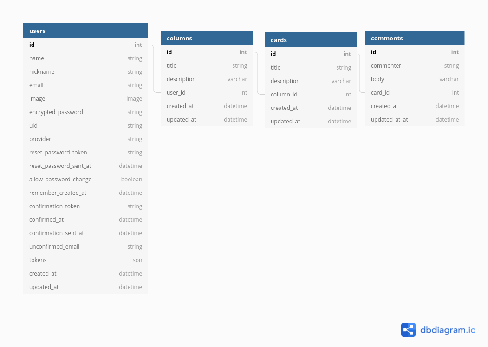

# Trello API

### Оглавление
1. [Задача](#Задача)
2. [Сущности](#Сущности)
3. [Требования](#Требования)
4. [Зависимости](#Зависимости)
    1. [Пакеты](#Пакеты)
    2. [Гемы](#Гемы)
5. [Использование](#Использование)
    1. [Пути для запросов](#Пути-для-запросов)
6. [Структура бд](#Структура-бд)

### Задача
Создать RESTful API с авторизацией для Trello на Ruby on Rails.

Спроектировать структуру БД при помощи dbdiagram.io

### Сущности
- пользователь
- колонка
- карточка
- комментарий

Один пользователь может иметь несколько колонок. Одна колонка может иметь несколько карточек. Одна карточка может иметь несколько комментариев

### Требования
1. Создать авторизацию пользователя через емейл + пароль (предварительно создаем модель пользователя). В ответ пользователь должен получать JWT токен, который мы будем прикреплять в Authorization headers и таким образом будем идентифицировать пользователей на backend. Используем gems device, devise_token_auth.
2. Подключаем базу данных PostgreSQL.Создать модели и реляционные связи между ними (пользователь, колонка, карточка, комментарий).
4. Создать CRUD. Эндпоинты по REST-у. Например юзера мы создаем через POST /users, конкретного юзера получаем через GET /users/{id}, колонки юзера получаем через GET /users/{id}/columns, удаляем через DELETE /users/{userId}/columns/{id} Более подробно читаем в интернете про конвенции RESTful API.
5. Должны валидировать все данные которые отправляет нам пользователь.  Валидация на емейл, строку, число, количество символов и т.д.
6. Должны проверять имеет ли право пользователь менять/удалять колонку/карточку/коммент (является ли владельцем этой сущности).
7. Если API метод возвращает данные, то это обязательно должен быть json объект или массив, а не просто строка или просто цифра.
8. Используем для документации Postman.

### Зависимости

#### Пакеты
- postgresql => 13.4
- ruby => 3.0.2
- docker => 20.10.10
- docker-compose => 2.1.1

#### Гемы
- rails => 6.x.x
- pg => 1.1
- jbuilder => 2.7
- rack-cors => 1.1.1
- devise_token_auth => 1.1.1

### Установка
1. Скачайте репозиторий и зайдите в директорию SecondTask:
```sh
$ git clone https://github.com/HAHAfreshe/PurrWeb.git
$ cd PurrWeb/SecondTask
```

2. Отредактируйте файл .env.
```sh
# .env
POSTGRES_USER=*ваше_имя_пользователя_postgres*
POSTGRES_PASSWORD=*ваш_пароль_postgres_бд*
```

3. Соберите образ docker-compose и запустите его
```sh
$ docker-compose build
$ docker-compose run web rails db:create
$ docker-compose run web rails db:migrate
$ docker-compose up
```
<i>При ошибке "Got permission denied" запускайте команды от имени суперпользователя</i>

Приложение будет находится по адресу: http://0.0.0.0:300

### Использование
Данное api приложение используется с помощью программ для отправки RESTful API запросов

#### Пути для запросов
<b>Важно:</b>
Для отправки запросов, нужно быть авторизированным пользователем(кроме запроса авторизации).
Для этого нужно добавить в HEADER запроса поля:
```sh
"access-token": "wwwww",
"token-type":   "Bearer",
"client":       "xxxxx",
"expiry":       "yyyyy",
"uid":          "zzzzz"
```
Данные поля можно получить при авторизации пользователя, в разделе HEADER ответа

<b>Пути апросов:</b>
- Авторизация, выход из сессии
```sh
POST /users/sign_in
DELETE /users/sign_out
```
- CRUD пользователя:
```sh
POST /users
GET /users
GET /users/:user_id
PUT /users/:user_id
DELETE /users/:user_id
```
- CRUD колонки пользователя
```sh
POST /users/:user_id/columns
GET /users/:user_id/columns
GET /users/:user_id/columns/:column_id
PUT /users/:user_id/columns/:column_id
DELETE /users/:user_id/columns/:column_id
```
- CRUD карточки
```sh
POST /users/:user_id/columns/:column_id/cards
GET /users/:user_id/columns/:column_id/cards
GET /cards/:card_id
PUT /cards/:card_id
DELETE /cards/:card_id
```
- CRUD комментария
```sh
POST /users/:user_id/columns/:column_id/cards/:card_id/comments
GET /users/:user_id/columns/:column_id/cards/:card_id/comments
GET /comments/:comment_id
PUT /comments/:comment_id
DELETE /comments/:comment_id
```

### Структура бд
[Диаграмма в dbdiagram.io](https://dbdiagram.io/d/6182e452d5d522682df773ae)

